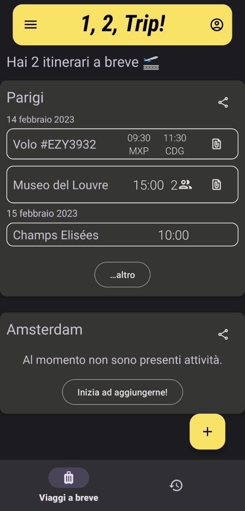
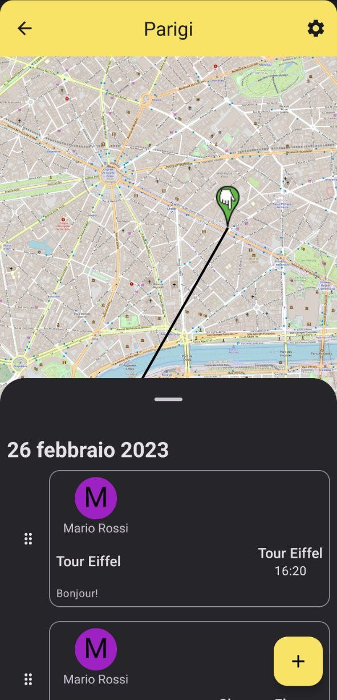
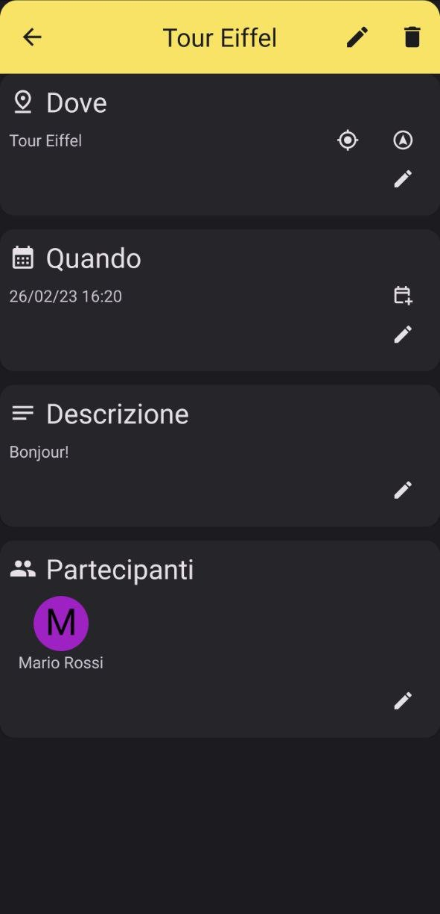

# *1, 2, Trip!*

by **TeamDroid** {   
&ensp; Alessandro Pucci (869177)   
  
&ensp; Matias Aldo Ruiz (869139)    
  
&ensp; Alessio Disarò (866247)     
  
&ensp; Ebraam Saad (856096)    
}    

   
Android app made for the exam of Mobile Development (academic year 2022-2023) at UniMiB.

# Features
This application was made with the aim of simplifying the organization of group travel.  

- Plan visits to your favorite places by adding points of interest
- Invite your travel companions: they will be able to suggest you new places you didn't know
- Receive notifications for upcoming trips or activities
- Open your logbook to consult all the stages of the journey with a list or in an interactive map
   
# Screenshots

